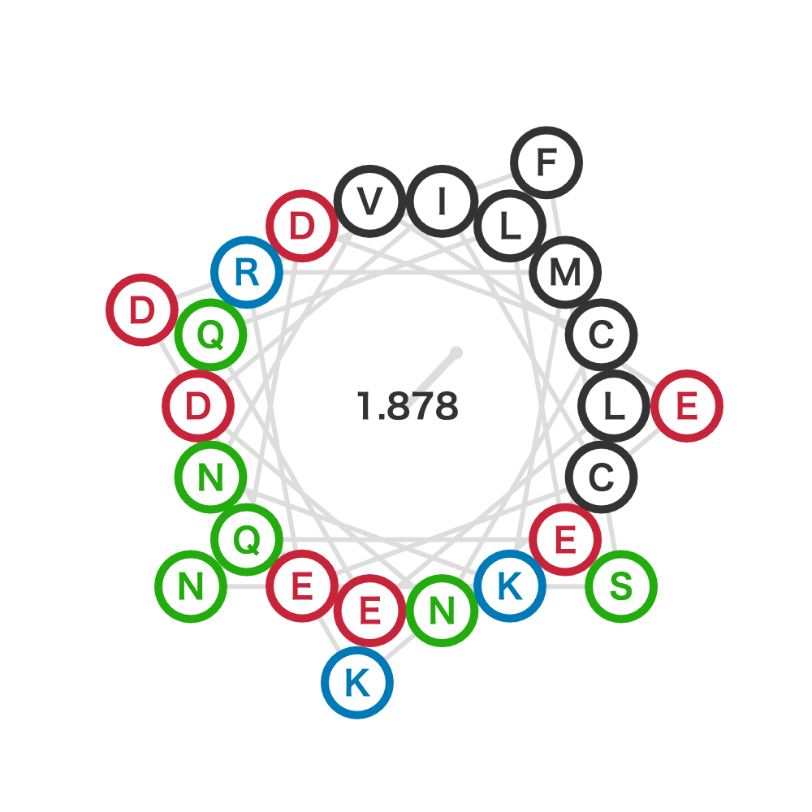

# wheel-diagram
Plot wheel diagram for alpha-helix.

# DEMO
Demonstration for a sequence "LEQLEQDCNDICERMKNVEKDFSN" from formin Fus1 in *Schizosaccharomyces pombe*.

 
# Features
 
 The Kyte and Doolittle's hydrophobicity is used.
 The hydrophobic moment is normalized by the sequence length.
 
# Requirement (validated version)
- Python (3.7.8)
 - matplotlib (3.3.1)
 
# Installation
  
Copy plot_wheel_diagram.py to wherever you like.
 
# Usage
  
```bash
python plot_wheel_diagram.py YOUR_SEQUENCE
```
 
# Note
  Helvetica is specified for default font.
  If you have an error, remove font specification.
 
# Author
 
- Rikuri Morita
- Center for Computational Sciences, University of Tsukuba
- morita@ccs.tsukuba.ac.jp
 
# License 
This script is under [MIT license](https://en.wikipedia.org/wiki/MIT_License).
